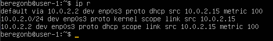

## Part 1. Установка ОС
1. 
    * Установка Ubuntu 20.04 Server LTS без графического интерфейса 
    * Проверяем версию Ubuntu командой `cat /etc/issue` 
     *Версия Ubuntu* 

## Part 2. Создание пользователя
1. 
    * Создаём нового пользователя командой `sudo adduser new_beregonb` 
      *Создание нового пользователя*
    * Вызываем команду `sudo usermod -aG adm new_beregonb` 
     *new_beregonb даны права администратора*
    * вызвваем команду `cat /etc/passwd`  
     *Проверка создания пользователя*

## Part 3. Настройка сети ОС
1. 
    * Изменяем название машины на user-1 с помощью команды `hostnamectl set-hostname user-1` 
     *Изменяем название машины*
    * Выполняем перезагрузку для сохранения изменений
    * Вызов `cat /etc/hostname`  
     *Проверяем изменение названия машины* 

2. 
    * Проверяем часовой пояс командой`timedatectl` 
     *Часовой пояс*
    * Изменяем часовой пояс командой `sudo timedatectl set-timezone Asia/Novosibirsk` 
     *Часовой пояс*

3. 
    * Вывод названия сетевых интерфейсов с помощью команды `ls /sys/class/net` 
     *Названия сетевых интерфейсов*
    * **Loopback** — совокупность методов, нужных для корректной работы маршрутизатора и передачи данных. 
    * Сам интерфейс же является отображением логических процессов в маршрутизаторе. Также саму технологию используют и для других целей: 
        1) тестирование передачи данных от обслуживающего центра коммутации; 
        2) проверка сигнала на расстоянии; 
        3) обеспечение работы коммутационных кабелей и их проверка; 
        4) тест обратной петли, когда сигнал посылается и возвращается отправителю по всем коммуникационным каналам. 

4. 
    * С помощью команды `ip r` получаем ip адрес устройства, на котором мы работаем, от DHCP сервера. 
     *ip-адрес устройства*
    * **Dynamic Host Configuration Protocol (DHCP)** - это протокол управления сетью, используемый в сетях TCP/IP, в котором DHCP-сервер динамически присваивает каждому устройству IP-адрес и другие параметры сетевой конфигурации, чтобы они могли связываться с другими IP-сетями. 

5. 
    * Определить и вывести на экран внешний ip-адрес шлюза `curl ifconfig.co` 
     *Внешний ip-адрес шлюза*
    * Определить внутренний IP-адрес шлюза, он же ip-адрес по умолчанию `ip route | grep default` 
     *Внутренний IP-адрес шлюза*

6. 
    * Настройка сетевых интерфейсов `sudo nano /etc/netplan/00-installer-config.yaml` 
     *Настройка сетевых интерфейсов*
    * Настройка DNS-серверов`sudo nano /etc/resolv.conf` 
     *Настройка DNS-серверов*
    * Перезагружаем виртуальную машину командой `reboot` 
    * Проверка работоспособности `ping -c 8 1.1.1.1 && ping -c 8 ya.ru` 
     *Проверяем настройки*

## Part 4. Обновление ОС 

1. 
    * Для обновления индекса пакетов или списка пакетов, воспользуемся командой `sudo apt update` 
     *Обновления*
    * Обновим системные пакеты до последней, на момент выполнения задания, версии, используя команду `sudo apt full-upgrade` 
     *Установка обновления*
    * Проверка обновления `sudo apt update` 
     *Проверка обновления*

## Part 5. Использование команды sudo

1. 
    * Разрешим пользователю, созданному в Part 2, выполнять команду sudo. Воспользуемся командой `sudo usermod -a -G sudo new_beregonb` 
    * Проверим к каким группам принадлежит пользователь new_beregonb с помощью команды `groups new_beregonb` 
     *Вывыполнение команды и проверка групп*
    * Sudo (Substitute user and do - подменить пользователя и выполнить) – это утилита для операционных систем семейства Linux, позволяющая пользователю запускать программы с привилегиями другой учётной записи, как правило, суперпользователя.

2. 
    * Поменяем hostname ОС от имени пользователя, созданного в пункте Part 2 (используя sudo). Для этого необходимо сменить текущего пользователя на ранее созданного  с помощью команды `su new_beregonb` 
    
    * Чтобы узнать текущее имя хоста воспользуемся командой `hostnamectl` 
     *Имя хоста*
    * Изменим имя хоста с user-1 на user-2 с помощью команды `sudo hostnamectl set-hostname user-2` и проверим 
     *Имя хоста измененное*
    * Выполним перезагрузку и проверим сохранность изменений 
     *Имя хоста измененное*

## Part 6. Установка и настройка службы времени

1. 
    * С помощью команды `date` выведем текущее время часового пояса, в котором мы находимся. Для вывода настроек часового пояса, используем команду `timedatectl show`
     *Настройки часового пояса*

## Part 7. Установка и использование текстовых редакторов

1. 
    * Выполним установку текстовых редакторов командами `sudo apt install vim`, `sudo apt install nano`, `sudo apt install mcedit` 
    * VIM. Запишем никнейм beregonb 
    *  *Ник VIM*
    * NANO. Запишем никнейм beregonb 
    *  *Ник NANO*
    * MCEDIT. Запишем никнейм beregonb 
    *  *Ник MCEDIT*

2. 
    * Запись "21 School 21" в файлы с выходом без сохранения
    *  *VIM*
    * Выходим командой `:q` 
    *  *NANO*
    * Выходим, при запросе сохнанения пишем `N` 
    *  *MCEDIT*
    * Выбираем `Нет` при запросе сохранения
    *  *Проверка информации с файлах*

3. 
    * Сделаем предыдущий пункт и сохраним 
    *  *Пример*
    * VIM. Поиск `ESC + /<слово_для_поиска>` 
    *  *Поиск слов в VIM*
    *  *Замена слов в VIM*
    * NANO. Поиск `Ctrl + W` 
    *  *Поиск слов в NANO*
    * Замена `Ctrl + \`. Сначала пишем заменяемо слово, потом слово для замены.
    *  *Замена слов в NANO*
    *  *Замена слов в NANO*
    *  MCEDIT. Поиск `F7`. Вводим и подтвержаем 
    *  *Поиск слов в MCEDIT*
    * Замена `F4` 
    *  *Замена слов в MCEDIT*
    * Подтвержаем 
    *  *Замена слов в MCEDIT*

## Part 8. Установка и базовая настройка сервиса SSHD

1. 
    * Установим службу SSHd с помощью команды `sudo apt install openssh-server` и проверим работоспособность `sudo systemctl status ssh` 
     
    * Как видно на скриншоте, автостарт SSHd службы добавлен автоматически при загрузке. Чтобы включить автостарт можно воспользоваться командой `sudo systemctl enable ssh`, для выключения автостарта команда `sudo systemctl disable ssh` 
    * Для перенастройки службы SSHd на порт 2022 откроем файл sshd_config с помощью команды `sudo nano /etc/ssh/sshd_config` 
    * Изменим значение параметра Port с 22 на 2022 
    * 
    * Покажем наличие процесса sshd, используя команду `ps aux | grep -i ssh` 
    * 
    * `ps` - утилита для просмотра списка процессов в Linux. Параметр `-a` - выбрать все процессы всех пользователей, кроме фоновых. Параметр -u обозначает ориентированный на пользователя формат, который предоставляет подробную информацию о процессах. Параметр `-x` указывает `ps` перечислить процессы без управляющего терминала. В основном это процессы, которые запускаются во время загрузки и работают в фоновом режиме.
    `grep -i ssh` - выводит только те строчки, где есть `ssh` с игнорированием регистра за счет `-i`    .
    Символ | перенаправляет вывод команды `ps aux` на ввод grep `-i ssh`.
    * Выполним перезагрузку машины командой reboot и выполним команду `netstat -tan` 
    * 
    * Опция **-a** показывает состояние всех сокетов; **-n** показывает ip адрес, а не сетевое имя; **-t** показывает только tcp соединения. 
    * Значения столбцов: 
        1) Proto - протокол, используемый сокетом; 
        2) Recv-Q - количество байтов, не скопированных пользовательской программой, подключенной к этому сокету; 
        3) Local Address - локальный адрес (имя локального хоста) и номер порта сокета; 
        4) Foreign Address - удаленный адрес (имя удаленного хоста) и номер порта сокета; 
        5) State - состояние сокета; 
        6) 0.0.0.0 в этом контексте означает "все IP-адреса на локальной машине". 
    * Перезагружаем систему командой `sudo reboot` 

## Part 9. Установка и использование утилит top, htop

1. 
    * Команда `top` выводит на экран 
     *вывод команды*
    * uptime - 3 минуты;
    * количество авторизованных пользователей - 1;
    * общую загрузку системы - 0.07;
    * общее количество процессов - 99;
    * загрузку cpu - 0.0 %;
    * загрузку памяти - 139.5 из 1971.6;
    * pid процесса занимающего больше всего памяти - 1;
    * pid процесса, занимающего больше всего процессорного времени - 1061.

2. 
    * Вывод команды `htop` без сортировки 
     
    * Для сортировки в `htop` нужно нажать `F6` и выбрать параметр сортировки 
     *htop отсортированный по `PID`*  
     *htop отсортированный по `PERCENT_CPU`* 
     *htop отсортированный по `PERCENT_MEM`*  
     *htop отсортированный по `TIME`*  
    * Для использования фильтров в `htop` нужно нажать `F4` и выбрать параметр фильтрации 
     *`htop`, отфильтрованный для процесса `SSHd`*  
    * Для использования поиска в htop нужно нажать `F3` и ввести объект поиска 
     * `htop` с процессом `syslog`, найденным, используя поиск*  
    * Для добавления отображения дополнительных параметров в `htop`, необходимо нажать `F2` и добавить 
     *требуемые параметры `htop` с добавленным выводом `hostname`, `clock` и `uptime`* 

## Part 10. Использование утилиты fdisk

1. 
    * Запустить команду `fdisk -l` 
     *вывод команды*
    * Название жесткого диска: VBOX HARDDISK (/dev/sda);
    * Размер диска: 20 Гигабайт;
    * Количество секторов: 41943040;
    * Размер swap: 0;

## Part 11. Использование утилиты df

1. 
    * Запустить команду `df` 
     *вывод команды*
    Для корневого раздела (/):
        - Размер раздела: 10218772;
        - Размер занятого пространства: 4711664;
        - Размер свободного пространства: 4966436;
        - Процент использования: 49 %; 
    Единицы измерения при выводе: Килобайты.

2. 
    * Выполним команду `df -Th` 
     *вывод команды*
    Для корневого раздела (/):
    - Размер раздела: 9.8;
    - Размер занятого пространства: 4.5;
    - Размер свободного пространства: 4.8;
    - Процент использования: 49 %;
    Единицы измерения при выводе: Гигабайты.
    Тип файловой системы: Ext4 - журналируемая файловая система, используемая в ОС на ядре Linux. Основана на файловой системе Ext3, но отличается тем, что в ней представлен механизм записи файлов в непрерывные участки блоков (екстенты), уменьшающий фрагментацию и повышающий производительность. В ней есть журналирование, то есть в ней предусмотрена запись некоторых данных, позволяющих восстановить файловую систему при сбоях в работе компьютера.

## Part 12. Использование утилиты du

1. 
    * Запустить команду `du` 
     *вывод команды*
    * Вывод размера папки /home, /var, /var/log в байтах и в человекочитаемом виде командами `sudo du -s /[имя папки]/` и `sudo du -sh /[имя папки]/`  
     *вывод команды*

2.  
    * Вывод размера всего содержимого папки /var/log в байтах и в человекочитаемом виде командами `sudo du /var/log/` и `sudo du -h /var/log/` 
     *вывод команды*
    * Вывод размера всего содержимого папки (каждого вложенного элемента) /var/log с использованием `*` командой `sudo du /var/log/* | less` 
     *вывод команды*

## Part 13. Установка и использование утилиты ncdu

1. 
    * Установим командой `sudo apt install ncdu` 
    * Вывести размер папок с помощью команды `ncdu`. /home, /var, /var/log. 
     *вывод команды* 
     *вывод команды* 
     *вывод команды* 

## Part 14. Работа с системными журналами

1. 
    * `/var/log/dmesg`— драйвера устройств. Содержит сообщения, полученные от ядра. Регистрирует много сообщений еще на этапе загрузки, в них отображается информация об аппаратных устройствах, которые инициализируются в процессе загрузки. Одноименной командой можно просмотреть вывод содержимого файла. Размер журнала ограничен, когда файл достигнет своего предела, старые сообщения будут перезаписаны более новыми. Откроем для просмотра файл `/var/log/dmesg` с помощью команды `less /var/log/dmesg` 
     *вывод команды*
    * `/var/log/syslog` — содержит глобальный системный журнал, в котором пишутся сообщения с момента запуска системы, от ядра Linux, различных служб, обнаруженных устройствах, сетевых интерфейсов и много другого. Откроем для просмотра файл `/var/log/syslog` с помощью команды `less /var/log/syslog` 
     *вывод команды*
    * `/var/log/auth.log` — информация об авторизации пользователей, включая удачные и неудачные попытки входа в систему, а также задействованные механизмы аутентификации. Откроем для просмотра файл`/var/log/auth.log` с помощью команды `less /var/log/auth.log` 
     *вывод команды*
    * Время последней успешной авторизации: sep 7, 8:49:38
    * Имя пользователя: user beregonb
    * Метод входа в систему: by uid = 0 (User Identifier). Суперпользователь всегда должен иметь UID, равный нулю (0).
    * Перезапустим службу SSHd с помощью команды `sudo systemctl restart ssh` 
     *вывод команды*

## Part 15. Использование планировщика заданий CRON

1. 
    * Запустим команду `uptime` через каждые 2 минуты. Для этого откроем планировщик заданий CRON в текстовом редакторе nano с помощью команды `crontab -e` и Добавим строчку `*/2 * * * * uptime` 
     *вывод изменения*
    * Найдем в системных журналах строчки о выполнении `uptime`. Для этого воспользуемся командой `less /var/log/syslog | grep CRON`
     *вывод команды*
    * Выведем на экран список текущих заданий для CRON с помощью команды `crontab -l` 
     *вывод команды*
    * Удалим все задания из планировщика заданий CRON с помощью команды `crontab -r` и проверим список текщих задач после удаления командой `crontab -l` 
     *вывод команды*

